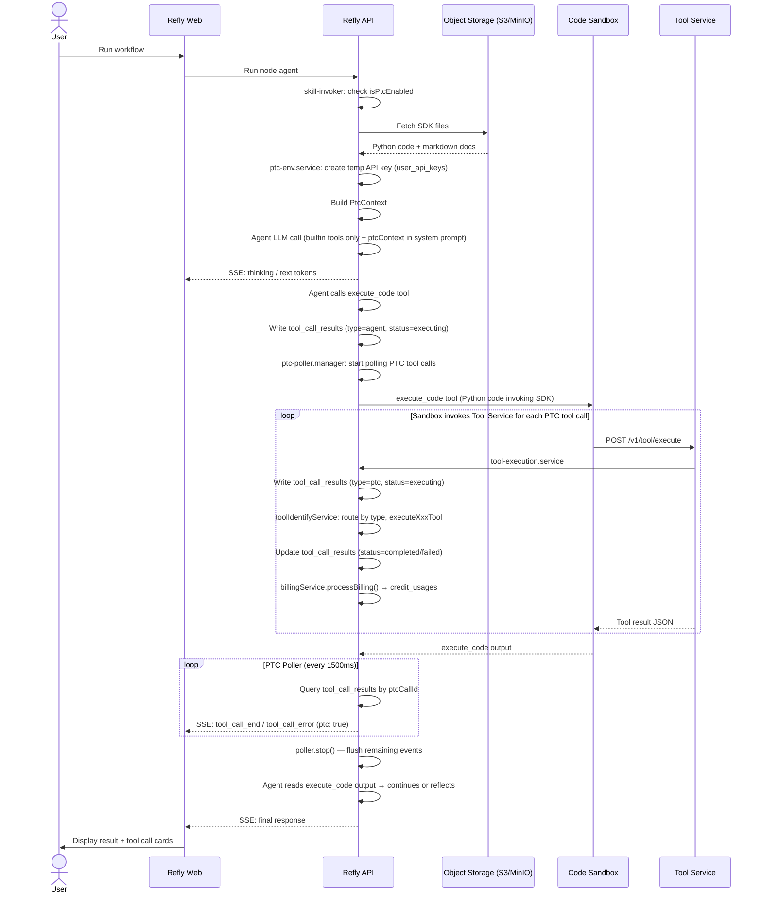

# PTC (Programmatic Tool Calling) — Reference

## Design Principle

PTC replaces JSON-schema tool calling with **Python code execution in a sandbox**. Instead of the model calling tools directly via function-calling, the model writes Python code that imports a generated SDK and calls tools as class methods. The sandbox runs the code and makes HTTP requests back to the Refly API to execute the actual tools.

**Why PTC?**
- Unlocks complex multi-step tool orchestration in a single model turn
- Enables batch processing, conditional logic, loops, data transformation in-flight
- Gives agent programmatic control (error handling, retry, data piping) unavailable with JSON tool calls

## Module Map

All PTC backend files live under `apps/api/src/modules/tool/ptc/`.

| File | Responsibility |
|------|---------------|
| `ptc-config.ts` | Mode control: reads env vars, answers "is PTC enabled for this user/toolset?" |
| `tool-definition.service.ts` | Schema export: converts all tool types to JSON Schema for Python SDK generation |
| `tool-execution.service.ts` | Tool execution: `POST /v1/tool/execute` handler, routes by tool type, writes DB records, handles billing |
| `tool-identify.service.ts` | Tool identification: queries DB, determines type (composio_oauth/composio_apikey/config_based/legacy_sdk) |
| `ptc-sdk.service.ts` | SDK injection: reads Python SDK files from S3, builds `PtcContext` with code + docs |
| `ptc-env.service.ts` | Env vars: prepares sandbox environment variables, manages temporary API key lifecycle |

Other modules that integrate with PTC:

| File | Role |
|------|------|
| `apps/api/src/modules/skill/skill-invoker.service.ts` | PTC decision point; builds ptcContext; starts/stops PTC poller |
| `apps/api/src/modules/config/app.config.ts` | Env parsing for `PTC_MODE`, allow/block lists, debug mode, and `PTC_SEQUENTIAL` |
| `apps/api/src/modules/skill/ptc-poller.manager.ts` | Polls DB for completed PTC tool calls, sends SSE events to frontend |
| `apps/api/src/modules/tool/tool.controller.ts` | Exposes `/v1/tool/execute` and `/v1/tool/toolset/exportDefinitions` endpoints |
| `apps/api/src/modules/tool/billing/billing.service.ts` | Processes credit deductions for PTC tool calls |
| `apps/api/src/modules/tool/billing/billing.dto.ts` | Billing data types including `toolCallId` linkage |
| `apps/api/src/modules/sandbox/sandbox.service.ts` | Sandbox orchestration; receives ptcContext, injects env vars |
| `packages/skill-template/src/prompts/node-agent.ts` | Builds node-agent prompt and injects `ptcEnabled`/`ptcSequential` template variables |
| `packages/agent-tools/src/builtin/sandbox.ts` | `execute_code` built-in tool; passes `ptcEnabled` and context |
| `packages/skill-template/src/prompts/templates/partials/ptc-mode.md` | System prompt partial; instructs model how to write PTC Python code |

## Invocation Chain

**Core loop**:
```
User submits task
  → Agent decides to use PTC (writes execute_code with Python)
    → Sandbox receives Python + injected SDK + env vars
      → Python code: `result = ToolsetClass.method_name(param=value)`
        → HTTP POST /v1/tool/execute → Refly API
          → Tool executed (Composio / Config-based / Legacy SDK)
            → Result returned to Python
              → PTC poller picks up completed tool_call_result record
                → SSE event streamed to frontend
  → Agent reads execute_code output → continues or reflects
```

### Phase 1: PTC Decision (Skill Invocation)

**`skill-invoker.service.ts`**:
1. Get user toolsets from config
2. Call `isPtcEnabledForToolsets` to judge whether PTC is enabled for the user and toolsets
3. Set `config.configurable.ptcEnabled = true/false`
4. Set `config.configurable.ptcSequential = ptcConfig.sequential` (from `PTC_SEQUENTIAL`)
5. If PTC is enabled and non-builtin toolsets exist:
   - Call `ptcSdkService.buildPtcContext` → reads Python SDK files from S3
   - Set `config.configurable.ptcContext = ptcContext`

### Phase 2: System Prompt & Tool Filtering

In `Agent.ts` (node agent), when `ptcEnabled=true`:
- Passes only **builtin tools** to the LLM
  - Builtins preserved: `read_file`, `list_files`, `read_agent_result`, `read_tool_result`, `get_time`, `execute_code`
  - Third-party tools (Composio, Config-based, Legacy SDK) are removed from the tool list
- Injects `ptcContext` into system prompt: SDK Python code + markdown docs for each toolset
- Injects `ptcSequential` into prompt template to control execution-order instructions:
  - `false` (default): allow parallel calls for independent read-only operations
  - `true`: force sequential execution for all tool calls

### Phase 3: Sandbox Execution

When agent calls `execute_code`:
1. `BuiltinExecuteCode` tool (in `sandbox.ts`) receives code + context
2. `SandboxService.executeCode()` called with `ptcEnabled=true`, `ptcContext`, `toolCallId`
3. SDK injection: sandbox receives Python files, writes them to `/refly_tools/` directory
4. Env var injection (in `ptc-env.service.ts`)
5. Sandbox runs Python code; SDK files are importable as `from refly_tools.<key> import <Class>`

### Phase 4: Tool Execution via HTTP

Each SDK call inside the sandbox makes `POST /v1/tool/execute` with:
- **Auth**: `Authorization: Bearer <REFLY_TOOL_SERVICE_API_KEY>`
- **Headers**:
  - `x-ptc-call-id: <REFLY_PTC_CALL_ID>` — parent execute_code call ID
  - `x-refly-result-id: <REFLY_RESULT_ID>`
  - `x-refly-result-version: <REFLY_RESULT_VERSION>`
  - `x-refly-canvas-id: <REFLY_CANVAS_ID>` — needed for file uploads

**`tool-execution.service.ts` flow**:
1. Extract `PtcToolExecuteContext` from headers
2. Generate `callId = "ptc:<uuid>"` (or `"standalone:<uuid>"` if no ptcCallId)
3. **Persist initial record** to `tool_call_results` with `status="executing"`, `type="ptc"`, `ptcCallId=<execute_code-callId>`
4. Call `toolIdentifyService.identifyTool(user, toolsetKey)` to determine type
5. Route to appropriate executor:
   - `composio_oauth` / `composio_apikey` → `executeComposioTool()`
   - `config_based` → `executeConfigBasedTool()` (AdapterFactory + HttpHandler)
   - `legacy_sdk` → `executeLegacySdkTool()` (LangChain `invoke()` in context)
6. **Persist final record** with `status="completed"|"failed"`, output/error
7. **Process billing** via `billingService.processBilling({uid, toolName, toolsetKey, toolCallId, ...})`
8. Return result to sandbox

### Phase 5: SSE Display via Polling

**`ptc-poller.manager.ts`** lifecycle (managed by `skill-invoker.service.ts`):
- `start(toolCallId)` called when execute_code begins
- Every 1500ms: query `tool_call_results WHERE ptcCallId = <execute_code-callId> AND status IN (completed, failed)`
- For each new result (not yet sent): emit SSE event `tool_call_end` or `tool_call_error`
- `stop(toolCallId)` called when execute_code completes (flushes remaining)
- SSE payload reuses `tool_call_end` format with `ptc: true` flag

## Tool Type Identification

**`tool-identify.service.ts`** routing logic:

```
toolsetKey
  ├─ Is builtin? → reject (not supported in PTC)
  ├─ Is MCP server? → reject (not supported in PTC)
  └─ Query toolset table (user-specific first, then global)
       ├─ authType = "oauth" → composio_oauth
       ├─ authType = "external_apikey" → composio_apikey
       └─ authType = "config_based" | "credentials" | null
            ├─ Has class in static toolsetInventory? → legacy_sdk
            └─ No class → config_based
```

**Legacy SDK tools**: Perplexity, Jina, Notion, Apify-13F

## Database Tables Written per PTC Run

### `action_results`

One record per agent node execution. Written before the agent starts running and updated when complete.

| Field | Value |
|-------|-------|
| `result_id` | Primary ID (prefix `ar-` or `sk-`) |
| `version` | Incremented on each re-run of the same node |
| `target_id` | Canvas ID (`c-xxx`) this result belongs to |
| `type` | Agent node type |
| `model_name` | LLM model used |
| `status` | `"running"` → `"finish"` or `"error"` |
| `title` | Node title (used for PTC debug mode detection) |
| `input` | JSON containing `query` and other context |
| `ptc_enabled` | Boolean, default `false`. Set to `true` in the final UPDATE when the run completes with PTC active. Pre-check failures stay `false`. |

### `action_messages`

One record per message in the LLM conversation for a given result version. Captures the full agent reasoning trace.

| Field | Value |
|-------|-------|
| `message_id` | Unique message ID |
| `result_id` | Parent action result ID |
| `version` | Action result version |
| `type` | `"human"`, `"ai"`, `"tool"` |
| `content` | Message content (text or JSON) |
| `tool_call_meta` | JSON `{ toolName, status, ... }` for tool messages |
| `tool_call_id` | Links tool result messages to their tool call |

### `tool_call_results`

One record per tool call. Written twice: once at start (`"executing"`) and updated on completion.

| Field | Value |
|-------|-------|
| `call_id` | `"ptc:<uuid>"` for PTC calls; `"agent:<uuid>"` for agent-level calls |
| `type` | `"agent"` (LLM-invoked) or `"ptc"` (sandbox-invoked) or `"standalone"` (direct API) |
| `ptc_call_id` | For PTC calls: the `call_id` of the parent `execute_code` agent tool call |
| `result_id` | Parent action result ID |
| `version` | Action result version |
| `uid` | User ID |
| `toolset_id` | Toolset key |
| `tool_name` | Tool name called |
| `input` | JSON-serialized input params |
| `output` | JSON-serialized result |
| `status` | `"executing"` → `"completed"` or `"failed"` |

The parent `execute_code` call writes a record with `type="agent"` (no `ptcCallId`). Each tool called inside the sandbox writes a child record with `type="ptc"` and `ptcCallId` pointing to the execute_code record's `call_id`.

### `credit_usages`

One record per successfully billed tool or model call (only global tools, only on success):

| Field | Value |
|-------|-------|
| `uid` | User ID |
| `action_result_id` | Matches `action_results.result_id` |
| `version` | Action result version |
| `usage_type` | `"tool_call"` or `"model_call"` |
| `tool_call_id` | Matches `tool_call_results.call_id` (linkage key for tool calls) |
| `tool_call_meta` | JSON `{ toolName, toolsetKey }` |
| `amount` | Credits actually charged (discounted price) |
| `due_amount` | Original price before discount |

**Billing rules**:
- Only global toolsets (`isGlobal=true`) are charged
- Only charged on success (errors are free)
- Free toolsets: `nano_banana_pro`, `instagram`, `facebook`, `twitter`, `fish_audio`, `seedream_image`
- Free for: `refly_plus_*` subscription users (1-month free tool access)
- Rates: Composio = 3 credits fixed; Config-based = from `BillingConfig` in DB; Legacy SDK = from `ToolCallResult.creditCost`

### `user_api_keys`

Temporary API key created by `ptc-env.service.ts` for sandbox auth:
- 1-day expiration
- SHA-256 hash stored in DB; plaintext injected into sandbox env
- In-memory cache (12-hour TTL) to avoid repeated DB writes per skill invocation

## Environment Variables

### PTC_MODE
Controls whether PTC is enabled. Default: `off`.

| Value | Effect |
|-------|--------|
| `off` | PTC disabled globally for all users |
| `on` | PTC enabled globally for all users |
| `partial` | PTC enabled only for users in `PTC_USER_ALLOWLIST` |

### PTC_DEBUG
Default: disabled (empty string).

A secondary filter applied **after** `PTC_MODE` + `PTC_USER_ALLOWLIST` have been evaluated. If those checks disable PTC for the user, `PTC_DEBUG` has no effect.

| Value | Behaviour |
|-------|-----------|
| unset / empty | No debug filtering; PTC_MODE + allowlist decide entirely |
| `opt-in` | PTC on only for nodes whose title contains `"useptc"` (case-insensitive) |
| `opt-out` | PTC on for all nodes except those whose title contains `"nonptc"` (case-insensitive) |
| `true` | Legacy alias for `opt-in` |

When any non-empty value is set, `REFLY_PTC_DEBUG=true` is injected into the sandbox environment.

### PTC_USER_ALLOWLIST
Comma-separated user IDs (e.g. `u-user1,u-user2`). Only used when `PTC_MODE=partial`.

### PTC_TOOLSET_ALLOWLIST
Comma-separated toolset keys. If set, only these toolsets can use PTC. Default: all toolsets allowed.

### PTC_TOOLSET_BLOCKLIST
Comma-separated toolset keys. These toolsets are always blocked from PTC, regardless of other settings (highest priority).

### PTC_SEQUENTIAL
Controls execution-order guidance in the PTC prompt. Default: `false`.

| Value | Effect |
|-------|--------|
| unset / `false` | Default mode: prompt allows guarded parallel execution (`ThreadPoolExecutor`) for independent read-only calls; serial for dependent/side-effect calls |
| `true` | Force sequential mode in prompt: all tool calls execute one-by-one |

### Scenarios

#### 1. Production — PTC Enabled for All Users
```env
PTC_MODE=on
```

#### 2. Production — PTC Disabled
```env
PTC_MODE=off
```

#### 3. Testing — Selective Users + Opt-out Debug
```env
PTC_MODE=partial
PTC_USER_ALLOWLIST=u-user1,u-user2
PTC_DEBUG=opt-out
```

#### 4. Local Dev — Opt-in Debug (only nodes whose title contains "useptc" trigger PTC)
```env
PTC_MODE=on
PTC_DEBUG=opt-in
```

#### 5. Local Dev — Opt-out Debug (all nodes except those whose title contains "nonptc" trigger PTC)
```env
PTC_MODE=on
PTC_DEBUG=opt-out
```

#### 6. Local Dev — Force Sequential PTC
```env
PTC_MODE=on
PTC_SEQUENTIAL=true
```

## SDK Development Workflow (refly-ptc toolchain)

The Python SDK files are authored and managed in a separate offline project: `refly-ptc`.

### Two-Project Architecture

```
refly-ptc/  (offline SDK toolchain)          refly/  (main platform)
─────────────────────────────────            ──────────────────────
Step 1: export tool definitions         ←──  GET /v1/tool/toolset/exportDefinitions
Step 2: generate Python SDK code
Step 3: upload SDK files to object storage ──→  S3/MinIO (versioned by hash)
                                             Step 4: update SANDBOX_S3LIB_HASH in apps/api/.env
                                                     + restart refly-api
                                                     refly-api reads SDK at runtime
                                                     (ptc-sdk.service.ts pulls from S3)
```

### Step-by-Step

**Step 1 — Export tool definitions**

```bash
uv run ptc tool definition <toolset>   # single toolset
uv run ptc tool definition all         # all toolsets
```

Calls `GET /v1/tool/toolset/exportDefinitions` → saves JSON schemas to `data/tool-definition/<toolset>.json`.

**Step 2 — Generate Python SDK**

```bash
uv run ptc generate <toolset>
uv run ptc generate all
```

Reads JSONs → produces:
- `libs/refly_tools/<toolset>.py` — Python SDK class
- `libs/refly_tools/docs/<toolset>.md` — markdown docs injected into system prompt

**Step 3 — Upload to object storage**

```bash
uv run ptc upload --local --hash <HASH>   # local MinIO (dev)
uv run ptc upload --s3 --hash <HASH>      # AWS S3 (prod)
```

Uploads `libs/refly_tools/` to path `<SANDBOX_S3LIB_PATH_PREFIX>/<HASH>/refly_tools/...`.

**Step 4 — Update env and restart API**

In `apps/api/.env`:
```env
SANDBOX_S3LIB_HASH=<HASH>
```

Then restart `refly-api`. `ptc-sdk.service.ts` reads `sandbox.s3Lib.hash` and constructs the full S3 path at invocation time: `<PATH_PREFIX>/<HASH>/refly_tools/<toolset>.py`.

Current dev values: `SANDBOX_S3LIB_PATH_PREFIX=tmp/perish/refly-executor-slim/refly-tools-dev`, `SANDBOX_S3LIB_HASH=PTC0g4v14`.

When toolsets change (new tools, updated schemas), repeat steps 1→2→3→4. No API redeploy needed beyond the env update + restart.

---

## Runtime Sequence Diagram



---

## Schema Export API

**Endpoint**: `GET /v1/tool/toolset/exportDefinitions?toolsetKeys=key1,key2`

Used by Python SDK generation pipeline. Returns JSON Schema for all supported tool types.

- Composio: schema from ComposioService dynamic fetch
- Config-based: schema from `toolset_inventory.request_schema` in DB
- Legacy SDK: schema from Zod-to-JSON-Schema conversion at runtime
- MCP and builtin tools: NOT exported

## Python SDK Pattern (in-sandbox)

```python
from refly_tools.<toolset_key> import <ToolsetClass>

# Tools are class methods (no instantiation needed)
result = ToolsetClass.tool_name(param1=value1, param2=value2)

# result is a dict with the tool output
```

## Current Implementation Status (as of 2026-02-25)

| Feature | Status |
|---------|--------|
| PTC mode toggle (env vars) | ✅ Complete |
| System prompt adaptation | ✅ Complete |
| Sandbox integration + temp API keys | ✅ Complete |
| SDK injection from S3 | ✅ Complete |
| Schema export: Composio | ✅ Complete |
| Schema export: Config-based | ✅ Complete |
| Schema export: Legacy SDK (Zod→JSON) | ✅ Complete |
| Tool execution: Composio | ✅ Complete |
| Tool execution: Config-based | ✅ Complete |
| Tool execution: Legacy SDK | ✅ Complete |
| SSE display via polling | ✅ Complete |
| Billing for all tool types | ✅ Complete |
| Billing toolCallId linkage | ✅ Complete |
| file_name_title field in schemas | ✅ Complete |
| File upload (canvasId context) | ⚠️ Planned — files return Buffer instead of DriveFile in PTC mode |

## Key Implementation Decisions

1. **Side-channel event architecture**: PTC tool calls are tracked separately from Agent-level tool calls via `type` field and `ptcCallId` linkage. Poller handles SSE delivery independently.

2. **DB as source of truth for streaming**: The polling model (`ptc-poller.manager.ts` → DB) allows multi-pod deployments — any pod can stream results regardless of which pod ran the tool.

3. **Temporary API keys per session**: Prevents long-lived credential exposure. 12-hour in-memory cache avoids thrashing DB on repeated calls within a session.

4. **Tool filtering in agent**: When PTC is enabled, only builtin tools are passed to the LLM. Third-party tools exist only in Python SDK form. This keeps the context clean and prevents double-execution.

5. **Blocklist > Allowlist precedence**: `PTC_TOOLSET_BLOCKLIST` always wins regardless of `PTC_TOOLSET_ALLOWLIST`, enabling safe exclusion of problem toolsets in production.

6. **callId prefixes for type identification**: `ptc:<uuid>` vs `standalone:<uuid>` vs (agent calls tracked separately in `action_results`) allows fast DB queries by call origin.

7. **Execution-order feature flag**: `PTC_SEQUENTIAL` provides a runtime safety switch to force serial PTC behavior without reverting prompt changes or redeploying.
